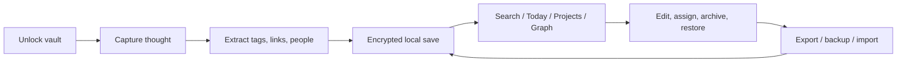
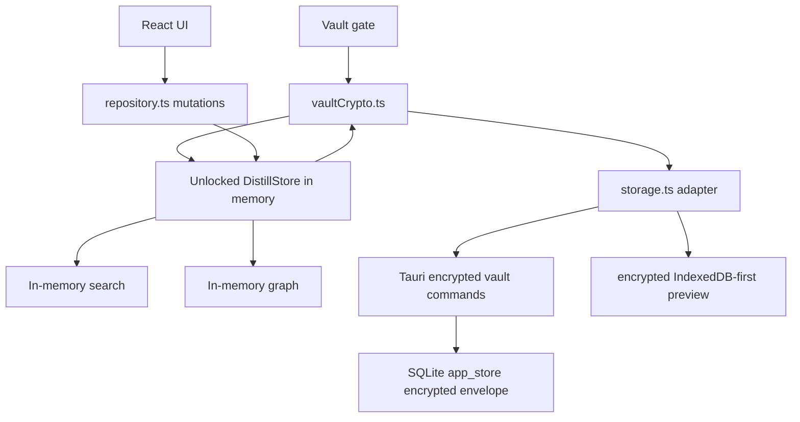

# Distill Design Blueprint

## One-Line Concept

Distill is a local-first personal thinking OS that captures thought fragments, reconnects them by meaning and context, and turns them into durable knowledge the user owns.

## Product Thesis

Distill should not compete as a generic note app. It should compete as a trusted thinking environment.

Core promise:

```text
Capture thoughts instantly, recover them by meaning later, connect them naturally, and keep ownership of the knowledge base.
```

## Design Principles

- Capture before structure: the inbox must be fast and forgiving.
- Meaning before folders: search and related context should help users rediscover ideas even when exact wording is forgotten.
- Blocks before pages: the main knowledge unit is a thought block, not a long document.
- Context is first-class: projects, people, dates, tags, links, and graph edges are part of the data model.
- Local-first trust: user data should remain usable offline, exportable, restorable, portable, and encrypted at rest.
- Explain retrieval: search should show why a result appeared, not only return a score.

## Current MVP Scope

Implemented through 0.1.8:

- Inbox capture.
- `#tag` extraction.
- `[[Wiki Link]]` extraction.
- `@person`, `[[Person: Name]]`, and `[[People/Name]]` extraction.
- Today view with daily-note grouping.
- Projects.
- Archive and restore.
- Inline edit.
- Processed/open state.
- Local semantic-overlap retrieval.
- Search evidence pills for matched fields and terms.
- Knowledge graph with block/project/person/concept nodes.
- Graph relationship filters.
- Graph neighbor inspection.
- Markdown export.
- JSON export.
- Validated JSON restore.
- Markdown bullet import.
- Encrypted vault backup/restore.
- Startup vault create/unlock screen.
- Normal encrypted local persistence.
- Legacy plaintext migration and clear.
- Storage path visibility.
- First-run onboarding.
- Signed auto-update check/install flow.
- Manual update launcher fallback for newer Distill setup packages.
- English/Japanese UI switching.
- PWA/mobile preview path.
- Windows NSIS installer.

Not included yet:

- Real embedding/vector search.
- Sync.
- Record-level encrypted sync records.
- Passphrase change flow.
- Lock-on-idle.
- Restore preview/conflict summary.
- Signed code-signing certificate/SmartScreen reputation.
- Multi-device conflict resolution.
- AI summarization or review workflows.

## User Experience Model

The intended loop:

1. Unlock the local vault.
2. Capture a fragment quickly.
3. Let Distill extract tags, links, people, and date context.
4. Revisit by search, project, person, graph, or daily note.
5. Assign useful blocks to projects.
6. Archive noise without deleting it.
7. Export or back up when needed.



## Information Architecture

Main surfaces:

- Vault Gate: create/unlock encrypted local vault.
- Inbox: unprocessed active thought blocks.
- Today: daily-note context and current focus.
- Search: hybrid retrieval and evidence.
- People: detected people and related blocks.
- Graph: knowledge graph across blocks, projects, people, and concepts.
- Projects: active knowledge work.
- Archive: hidden but restorable blocks.
- Inspector: selected-block context, project assignment, storage, import/export, vault backup, updates.

## Core Data Model

Current frontend store:

```ts
type DistillStore = {
  blocks: ThoughtBlock[];
  projects: Project[];
};

type ThoughtBlock = {
  id: string;
  content: string;
  noteId: string;
  projectId?: string;
  capturedAt: string;
  updatedAt: string;
  tags: string[];
  links: string[];
  state: 'open' | 'linked' | 'processed' | 'archived';
};

type Project = {
  id: string;
  name: string;
  signal: string;
  status: 'Active' | 'Design' | 'Next';
};
```

Current persistence:

- Encrypted whole-store vault envelope under `distill.vault.v1`.
- Desktop stores the envelope in SQLite `app_store`.
- Browser preview stores the envelope in localStorage.
- Search and graph are derived from the decrypted in-memory store after unlock.

Future target schema expands toward:

- encrypted block records
- encrypted project records
- append-only encrypted mutation log
- entities
- links
- tags
- embeddings generated after unlock
- sources
- events
- settings

## Architecture

Current stack:

- Frontend: React + TypeScript + Vite.
- Desktop shell: Tauri 2.
- Desktop persistence: encrypted vault envelope through Rust Tauri commands.
- Browser fallback: encrypted vault envelope in IndexedDB when available, with localStorage fallback.
- Encryption: WebCrypto PBKDF2 SHA-256 and AES-256-GCM.
- Testing: Vitest, Rust tests, Playwright E2E.
- Packaging: Tauri NSIS Windows installer.

Current boundaries:

- `src/App.tsx`: UI orchestration, vault lifecycle, autosave, updater flow.
- `src/components/VaultGate.tsx`: vault create/unlock UI.
- `src/vaultCrypto.ts`: vault encryption/decryption.
- `src/model.ts`: core types, extraction, search model.
- `src/repository.ts`: immutable store mutation functions.
- `src/storage.ts`: encrypted persistence and legacy migration boundary.
- `src/graph.ts`: graph construction, filtering, layout, neighbors.
- `src/import.ts`: JSON restore validation and Markdown import.
- `src/export.ts`: JSON/Markdown export and browser downloads.
- `src-tauri/src/lib.rs`: encrypted vault storage, legacy plaintext clear, storage info, update launcher.



## Search Design

Search has three layers:

- Recent retrieval for empty query.
- Exact retrieval over content, tags, and links.
- Local semantic-overlap retrieval using controlled aliases.

Search result contract:

```ts
type SearchResult = {
  block: ThoughtBlock;
  score: number;
  reason: string;
  matchedFields: string[];
  matchedTerms: string[];
};
```

Evidence fields:

- `content`
- `tags`
- `links`
- `semantic`

Current limitation:

- Semantic overlap is alias-based, not embedding-based.
- Persistent plaintext indexes are intentionally avoided.

## Graph Design

Graph node kinds:

- `block`
- `project`
- `person`
- `concept`

Graph edge types:

- `project`
- `person`
- `concept`

Graph behavior:

- Active blocks become graph nodes.
- Assigned projects connect to blocks.
- People extracted from mentions connect to blocks.
- Wiki links become concept nodes and connect to blocks.
- Edge filters narrow visible relationship types.
- Neighbor inspection shows what a selected node connects to.

## Portability And Trust

Portability features:

- JSON export.
- Markdown export.
- Validated JSON restore.
- Markdown bullet import.
- Encrypted vault backup/restore.
- Encrypted latest desktop backup.

Desktop paths:

```text
C:\Users\awake\AppData\Roaming\app.distill.local\distill.sqlite3
C:\Users\awake\AppData\Roaming\app.distill.local\backups\distill-encrypted-vault-latest.json
```

Trust limitations:

- Installer does not yet have public code-signing certificate reputation.
- Passphrase is held in app memory while unlocked.
- Current vault is whole-store encryption, not record-level encryption.
- No sync yet.
- Browser preview depends on localStorage for encrypted envelope storage.

## Verification Status

Current passing suite:

- Frontend/domain tests: 19 passed.
- Rust tests: 10 passed.
- Browser E2E smoke tests: 9 passed.
- Production frontend build: passing.

## Roadmap

### Phase 1: Desktop MVP

Status: complete.

### Phase 2: Practical Use Hardening

Status: complete for local MVP.

### Phase 3: Trust Layer

Status: in progress.

Next:

- Passphrase change.
- Lock-on-idle.
- Restore preview.
- Corrupted/tampered vault tests.
- User-selectable vault location.
- Record-level encrypted records.

### Phase 4: Retrieval Upgrade

Goal:

- Replace alias-based semantic overlap with real local embedding/vector retrieval after unlock.

### Phase 5: Knowledge Maturation

Goal:

- Help users turn fragments into structure notes, reviews, summaries, and outputs.

### Phase 6: Sync

Goal:

- Add encryption-first multi-device sync using record-level encrypted data.

## Recommended Next Decision

For private use:

- Use the app for 7 days with real notes.
- Keep encrypted vault backups.
- Track friction.

For public distribution:

- Prioritize code signing, installer trust, auto-update hygiene, and a public download page.

For product quality:

- Prioritize passphrase lifecycle, restore preview, and then embedding/vector search.
