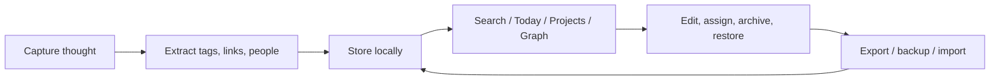
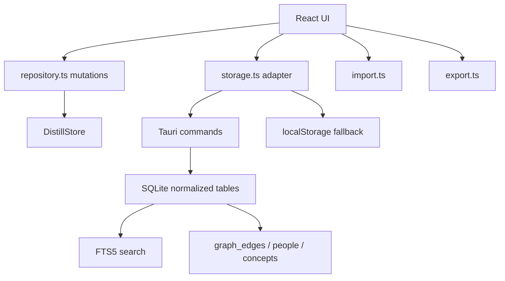

# Distill Design Blueprint

## One-Line Concept

Distill is a local-first personal thinking OS that captures thought fragments, reconnects them by meaning and context, and turns them into durable knowledge the user owns.

## Product Thesis

Distill should not compete as a generic note app. It should compete as a trusted thinking environment.

The core product promise is:

```text
Capture thoughts instantly, recover them by meaning later, connect them naturally, and keep ownership of the knowledge base.
```

## Design Principles

- Capture before structure: the inbox must be fast and forgiving.
- Meaning before folders: search and related context should help users rediscover ideas even when exact wording is forgotten.
- Blocks before pages: the main knowledge unit is a thought block, not a long document.
- Context is first-class: projects, people, dates, tags, links, and graph edges should be part of the data model.
- Local-first trust: user data should remain usable offline, exportable, restorable, and portable.
- Explain retrieval: search should show why a result appeared, not only return a score.

## Target User

Primary user:

- A knowledge worker, founder, researcher, creator, or strategist who captures many fragmented ideas.
- Wants fast capture, later rediscovery, and long-term ownership.
- Does not want their thinking trapped in a closed SaaS system.

Secondary user:

- A solo builder or small team member who wants a local thinking environment before adopting collaboration/sync.

## Current MVP Scope

Implemented in 0.1.0:

- Inbox capture.
- `#tag` extraction.
- `[[Wiki Link]]` extraction.
- `@person`, `[[Person: Name]]`, and `[[People/Name]]` extraction.
- Today view with daily-note grouping.
- Projects.
- Archive and restore.
- Inline edit.
- Processed/open state.
- SQLite-backed desktop persistence.
- Browser `localStorage` fallback.
- SQLite FTS5 search.
- Local semantic-overlap retrieval.
- Search evidence pills for matched fields and terms.
- Knowledge graph with block/project/person/concept nodes.
- Graph relationship filters.
- Graph neighbor inspection.
- Markdown export.
- JSON export.
- Manual JSON backup.
- Automatic latest local backup.
- Validated JSON restore.
- Markdown bullet import.
- Storage path visibility.
- First-run onboarding.
- Signed auto-update check/install flow.
- Manual update launcher fallback for newer Distill setup packages.
- English/Japanese UI switching.
- Windows NSIS installer.

Not included yet:

- Embedding/vector search.
- Sync.
- Encryption.
- Signed installer.
- Public hosted update feed.
- Multi-device conflict resolution.
- AI summarization or review workflows.

## User Experience Model

The intended loop:

1. Capture a fragment quickly.
2. Let Distill extract tags, links, people, and date context.
3. Revisit by search, project, person, graph, or daily note.
4. Assign useful blocks to projects.
5. Archive noise without deleting it.
6. Export or backup regularly.



## Information Architecture

Main surfaces:

- Inbox: unprocessed active thought blocks.
- Today: daily-note context and current focus.
- Search: hybrid retrieval and evidence.
- People: detected people and related blocks.
- Graph: knowledge graph across blocks, projects, people, and concepts.
- Projects: active knowledge work.
- Archive: hidden but restorable blocks.
- Inspector: selected-block context, project assignment, storage, import/export.

## Core Data Model

Current frontend store:

```ts
type DistillStore = {
  blocks: ThoughtBlock[];
  projects: Project[];
};

type ThoughtBlock = {
  id: string;
  content: string;
  noteId: string;
  projectId?: string;
  capturedAt: string;
  updatedAt: string;
  tags: string[];
  links: string[];
  state: 'open' | 'linked' | 'processed' | 'archived';
};

type Project = {
  id: string;
  name: string;
  signal: string;
  status: 'Active' | 'Design' | 'Next';
};
```

Current desktop SQLite tables:

- `projects`
- `blocks`
- `block_tags`
- `block_links`
- `blocks_fts`
- `people`
- `block_people`
- `concepts`
- `graph_edges`
- `app_store`

Future target schema expands toward:

- `notes`
- `blocks`
- `entities`
- `links`
- `tags`
- `embeddings`
- `sources`
- `events`
- `settings`

## Architecture

Current stack:

- Frontend: React + TypeScript + Vite.
- Desktop shell: Tauri 2.
- Desktop persistence: SQLite through Rust Tauri commands.
- Browser fallback: `localStorage` and in-memory search.
- Testing: Vitest, Rust tests, Playwright E2E.
- Packaging: Tauri NSIS Windows installer.

Current boundaries:

- `src/App.tsx`: UI orchestration and user intent.
- `src/model.ts`: core types, extraction, search model.
- `src/repository.ts`: immutable store mutation functions.
- `src/storage.ts`: persistence/search/graph adapter boundary.
- `src/graph.ts`: graph construction, filtering, layout, neighbors.
- `src/import.ts`: JSON restore validation and Markdown import.
- `src/export.ts`: JSON/Markdown export and browser downloads.
- `src-tauri/src/lib.rs`: SQLite persistence, FTS search, graph snapshots, storage info, backup writing.



## Search Design

Search has three layers:

- Recent retrieval for empty query.
- Exact/FTS retrieval over content, tags, and links.
- Local semantic-overlap retrieval using controlled aliases.

Search result contract:

```ts
type SearchResult = {
  block: ThoughtBlock;
  score: number;
  reason: string;
  matchedFields: string[];
  matchedTerms: string[];
};
```

Evidence fields:

- `content`
- `tags`
- `links`
- `semantic`

Current limitation:

- Semantic overlap is alias-based, not embedding-based.
- It improves fuzzy rediscovery but is not a vector search replacement.

## Graph Design

Graph node kinds:

- `block`
- `project`
- `person`
- `concept`

Graph edge types:

- `project`
- `person`
- `concept`

Graph behavior:

- Active blocks become graph nodes.
- Assigned projects connect to blocks.
- People extracted from mentions connect to blocks.
- Wiki links become concept nodes and connect to blocks.
- Edge filters narrow visible relationship types.
- Neighbor inspection shows what a selected node connects to.

## Portability And Trust

Portability features:

- JSON export.
- Markdown export.
- Validated JSON restore.
- Markdown bullet import.
- Manual JSON backup.
- Automatic latest local backup.

Desktop paths verified on installed app:

```text
C:\Users\awake\AppData\Roaming\app.distill.local\distill.sqlite3
C:\Users\awake\AppData\Roaming\app.distill.local\backups\distill-auto-backup-latest.json
```

Trust limitations:

- Installer is unsigned.
- Signed auto-update is implemented locally; public distribution still requires uploading `latest.json`, installer, and signature to the configured release host.
- No encryption yet.
- No sync yet.
- No backup generation history yet, only latest automatic backup plus manual timestamped backups.

## Verification Status

Current passing suite:

- Frontend/domain tests: 17 passed.
- Rust/SQLite tests: 8 passed.
- Browser E2E smoke tests: 9 passed.
- Production frontend build: passing.
- Windows Tauri build: passing.

Installed-app verification:

- Installed executable found.
- App process verified.
- SQLite file verified.
- Normalized indexes verified.
- Automatic latest backup verified.
- Captured Japanese user data verified in SQLite and backup.

## Release Artifact

Installer:

```text
src-tauri/target/release/bundle/nsis/Distill_0.1.1_x64-setup.exe
```

SHA256:

```text
5E13BA109491348C58B00A498FBFA5396CD906263A70619D3DF3F1FD77A2CC81
```

## Roadmap

### Phase 1: Desktop MVP

Status: complete.

Goal:

- Create a working local-first personal thinking app.

### Phase 2: Practical Use Hardening

Status: functionally complete for local MVP.

Goal:

- Make the MVP safe enough for real local use.

### Phase 3: Retrieval Upgrade

Next major technical phase.

Goal:

- Replace alias-based semantic overlap with real embedding/vector retrieval.

Planned work:

- Embedding generation.
- Vector index storage.
- Hybrid FTS + vector ranking.
- Stronger result explanations.
- Related-note recommendations.

### Phase 4: Knowledge Maturation

Goal:

- Help users turn fragments into structure notes, reviews, summaries, and outputs.

### Phase 5: Trust Layer

Goal:

- Add encryption, user-selectable vault location, signed installer, and auto-update.

### Phase 6: Context Integrations

Goal:

- Add calendar, meetings, people pages, timelines, and source/document attachments.

## Recommended Next Decision

For private use:

- Use the app for 7 days with real notes.
- Back up JSON daily.
- Track friction.

For public distribution:

- Prioritize code signing, installer trust, auto-update, and a public download page.

For product quality:

- Prioritize embedding/vector search and daily/weekly review workflows.


