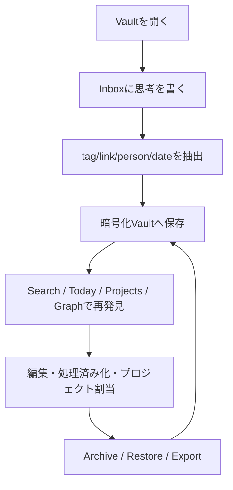
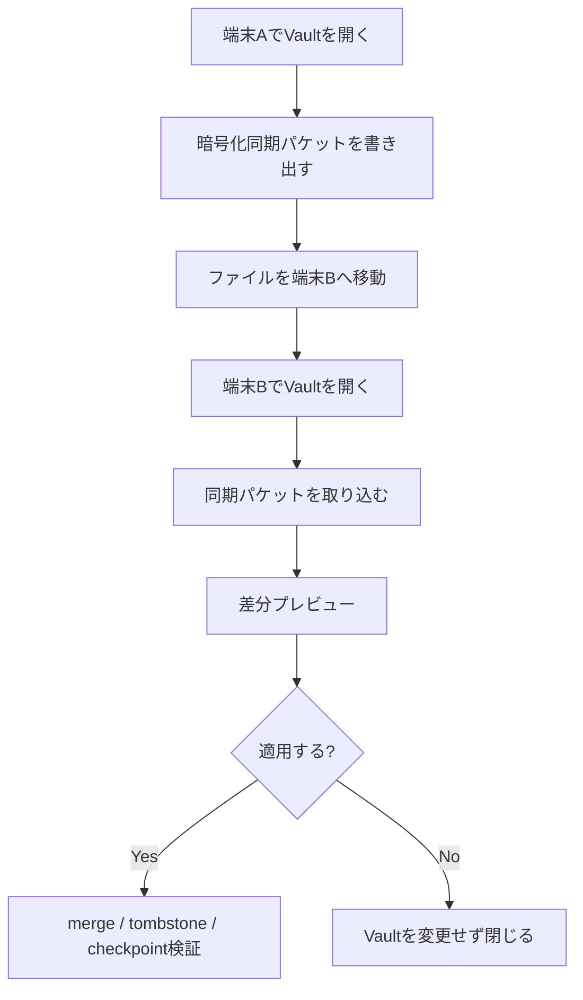
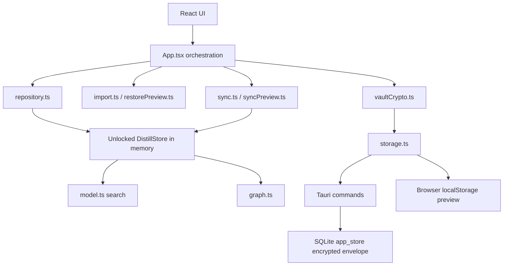

# Distill System Design

作成日: 2026-05-06  
対象バージョン: 0.1.16 release candidate  
対象読者: 実装者、設計レビュー担当、将来のエージェント、共同開発者

## 1. 概要

Distill は、個人の思考断片を素早く捕まえ、後から意味・文脈・関係性で再発見し、長期的に所有できる知的資産へ育てるための local-first 思考整理アプリである。

単なるメモアプリではなく、次の価値を中核に置く。

- すぐ書ける
- 後から意味で見つかる
- ブロック単位でつながる
- 日付・人・プロジェクトの文脈を持つ
- ユーザーがデータを所有し、暗号化された形で保持できる

プロダクトの一文定義:

```text
思考の断片を、生活文脈つきで保存し、意味で再発見でき、構造化と同期を通じて知識へ変えていく、所有可能な個人思考OS。
```

## 2. 現在の到達点

現時点の完成度目安:

- ローカル個人MVP: 約89%
- 知人に配れるベータ: 約60%
- 本格製品: 約35%

実装済みの大きな柱:

- Inbox / Today / Search / Projects / Graph / Archive / Inspector
- `#tag`, `[[link]]`, `@person` 抽出
- 日次ノートとプロジェクト文脈
- ローカル意味検索風の semantic-overlap 検索
- 検索理由と matched fields / terms
- People index
- ナレッジグラフと近傍表示
- Markdown / JSON export
- JSON / Markdown import
- Restore preview
- 暗号化 Vault
- Vault passphrase change
- auto-lock
- encrypted vault backup / restore
- signed updater flow
- manual update fallback
- manual encrypted sync packet
- sync apply preview
- sync deletion tombstones
- known device registry
- stale packet rejection
- chained packet checkpoint validation
- revoked device registry and rejection
- desktop sync-folder packet exchange prototype
- English / Japanese UI
- Windows Tauri desktop build
- Personal KM summary-only handoff
- render error boundary

まだ本格製品化前に必要な大物:

- 実ベクトル検索
- 自動同期
- モバイルアプリまたは高品質PWA
- 署名証明書と SmartScreen 評判
- user-selectable vault location
- record-level encrypted normal persistence
- 強い復旧導線
- 競合レビュー画面

## 3. 設計原則

1. Capture before structure

最初に整理を要求しない。書く速度を最優先し、構造化は後から行えるようにする。

2. Blocks before pages

知識の最小単位はページではなく thought block。検索、リンク、同期、削除履歴も block を中心に設計する。

3. Meaning before folders

ユーザーは正確な言葉を覚えていないことが多い。検索はキーワード一致だけでなく、言い換え・関連語・リンク文脈・日付文脈を扱う。

4. Context is data

日付、人、プロジェクト、タグ、リンク、状態は UI の飾りではなく、再発見と整理に使う一級データである。

5. Trust before convenience

個人の思考は高感度データである。同期やAIより先に、暗号化、可搬性、ローカル所有、復旧可能性を設計の土台にする。

## 4. 主要ユーザーフロー



同期を使う場合:



## 5. 情報設計

### 5.1 ナビゲーション

現在の主要画面:

- Inbox: 未処理の思考断片
- Today: 今日の文脈と日次ノート
- Search: 意味検索、検索理由、関連探索
- Projects: 作業単位の整理
- Graph: ブロック、人、概念、プロジェクトの関係
- Archive: 表示から外したブロック
- Inspector: 選択ブロックの文脈、保存、復元、同期、更新、Vault管理

### 5.2 コアオブジェクト

```ts
type DistillStore = {
  blocks: ThoughtBlock[];
  projects: Project[];
  sync?: SyncMetadata;
};

type ThoughtBlock = {
  id: string;
  content: string;
  noteId: string;
  projectId?: string;
  capturedAt: string;
  updatedAt: string;
  tags: string[];
  links: string[];
  state: 'open' | 'linked' | 'processed' | 'archived';
};

type Project = {
  id: string;
  name: string;
  signal: string;
  status: 'Active' | 'Design' | 'Next';
};
```

同期メタデータ:

```ts
type SyncMetadata = {
  tombstones: DeletionTombstone[];
  devices: SyncDevice[];
  revokedDevices: RevokedSyncDevice[];
};
```

## 6. アーキテクチャ

### 6.1 全体構成



### 6.2 技術スタック

- Frontend: React, TypeScript, Vite
- Desktop: Tauri 2
- Backend boundary: Rust Tauri commands
- Persistence: encrypted vault envelope
- Desktop storage: SQLite `app_store`
- Browser preview: `localStorage`
- Crypto: WebCrypto PBKDF2 SHA-256 + AES-256-GCM
- Tests: Vitest, Rust tests, Playwright
- Packaging: Tauri NSIS installer
- Update: Tauri updater + GitHub Releases feed

### 6.3 重要ファイル

- `src/App.tsx`: アプリ全体の状態制御、Vault、同期、更新、import/export
- `src/model.ts`: 型、抽出、検索
- `src/repository.ts`: immutable mutation
- `src/vaultCrypto.ts`: Vault暗号化
- `src/storage.ts`: Desktop/browser persistence adapter
- `src/sync.ts`: 同期パケット、merge、device registry、checkpoint
- `src/syncPreview.ts`: 同期適用前プレビュー
- `src/restorePreview.ts`: restore適用前プレビュー
- `src/import.ts`: JSON/Markdown import validation
- `src/graph.ts`: graph生成と近傍取得
- `src-tauri/src/lib.rs`: Tauri command boundary
- `src-tauri/capabilities/default.json`: frontendから呼べるTauriコマンド制限

## 7. 保存と暗号化設計

### 7.1 現在のVault境界

通常保存は暗号化Vaultとして行う。

- storage key: `distill.vault.v1`
- envelope type: `distill.encrypted-vault`
- KDF: PBKDF2
- hash: SHA-256
- default iterations: 310,000
- cipher: AES-256-GCM
- salt: 16 random bytes
- IV: 12 random bytes

Desktopでは暗号化 envelope を SQLite に保存する。Browser/PWA preview では localStorage に保存する。

### 7.2 守れるもの

- block content
- project names / signals
- tags
- links
- people references
- encrypted vault backups
- normal local persistence

### 7.3 まだ守りきれていないもの

- unlock中のメモリ上の復号済みstore
- unlock中のpassphrase
- OSやユーザーが作った手動JSON export
- ブラウザprofile自体の削除や改ざん
- SmartScreen信頼

このため、現在の暗号化は「local-first思考アプリとして妥当な暗号化」であり、password manager級の硬化とは分けて扱う。

## 8. 同期設計

### 8.1 方針

同期は encryption-first で進める。サーバーやクラウドに平文ノートを置かない。

現在は自動同期ではなく、手動 encrypted sync packet を使う。理由は、transport を複雑にする前に merge / tombstone / checkpoint / device trust を検証するため。

### 8.2 現在の同期パケット

外側には同期に必要な最小メタデータを置き、record payload は暗号化する。

```json
{
  "type": "distill.encrypted-sync.packet",
  "schemaVersion": 1,
  "sourceDeviceId": "device-windows",
  "sourceDeviceName": "Windows desk",
  "createdAt": "2026-05-06T00:00:00.000Z",
  "previousPacketHash": "fnv1a32:previous",
  "packetHash": "fnv1a32:current",
  "devices": [],
  "revokedDevices": [],
  "records": []
}
```

実装済み:

- block sync record
- thought-block deletion tombstone
- record-level encrypted payload
- metadata tamper detection
- device identity
- known device registry
- revoked device registry
- desktop sync-folder packet exchange prototype
- stale packet rejection
- chained checkpoint validation
- apply preview
- deterministic merge

### 8.3 Merge規則

- local missing なら remote block を追加
- remote.updatedAt が新しければ remote block を採用
- local.updatedAt が新しければ local block を維持
- deletion tombstone が新しければ block を削除
- 古いパケットや取り込み済みパケットは skip
- known device の hash chain につながらない新しいパケットは reject
- revoked device からのパケットは reject

### 8.4 次の同期設計

次の本命は automatic encrypted folder sync。現在は、その前段として desktop sync-folder packet exchange prototype を実装している。指定フォルダへ暗号化同期パケットを書き出し、同じフォルダ内のパケット候補をスキャンし、選択したパケットを既存のpreview/apply flowへ通す方式である。

推奨順序:

1. sync folder location を選べるようにする。Prototype complete
2. encrypted packet log をローカルフォルダへ出力。Prototype complete
3. フォルダ内の未取り込みpacketをscan。Prototype complete
4. preview付きでimport。Prototype complete
5. conflict reviewを追加
6. OneDrive / iCloud / Dropbox / Syncthing をtransportとして使う
7. record-level encrypted normal persistenceへ拡張

## 9. 検索設計

現在の検索は local semantic-overlap であり、実ベクトル検索ではない。

現在:

- content / tags / links exact match
- matched fields
- matched terms
- reason string
- controlled aliasによる意味近似
- selected block related context

目標:

- unlock後にlocal embedding生成
- local vector index
- exact + vector + graph expansion の hybrid retrieval
- なぜ出たかを説明
- 関連block推薦
- AI要約は明示操作に限定

検索結果の信頼性を高めるため、スコアだけでなく evidence を必ず表示する。

## 10. モバイル方針

現実的な順序:

1. PWA previewを改善
2. mobile viewportの主要ワークフローを固める
3. capture / search / read / sync import を優先
4. 重いgraph編集や複雑なsettingsはdesktop優先
5. Tauri mobileまたはReact Nativeは、sync format安定後に判断

モバイルで最初に必要な機能:

- vault unlock
- quick capture
- search
- today
- project assignment
- encrypted sync packet import/export
- emergency encrypted vault backup

## 11. 更新配布設計

現在は Tauri updater と GitHub Releases を使う。

配布物:

- `Distill_<version>_x64-setup.exe`
- `Distill_<version>_x64-setup.exe.sig`
- `latest.json`

アプリ側:

- release feed URLを参照
- newer version のみ検知
- signature を検証
- install update を実行
- manual installer fallbackも維持

残課題:

- Windows code signing certificate
- SmartScreen reputation
- release automationの完全CI化
- rollback時の運用手順

## 12. セキュリティ評価

現在の強み:

- normal persistenceは暗号化済み
- legacy plaintext clearがある
- Tauri command exposureを絞っている
- wrong passphrase / tamper testsがある
- restore previewがある
- sync previewがある
- stale/replay guardがある
- hash-chain checkpointがある
- revoked device rejectionがある
- desktop sync-folder commands validate packet file name, schema, and size before reading or writing

主要リスク:

- passphraseがunlock中にmemoryへ残る
- whole-store encryptionは大きくなるとsyncに不利
- user-selectable vault locationが未実装
- automatic background syncが未実装
- signing certificateが未導入
- モバイルでの安全な保存設計が未確定
- 実ベクトル検索のindex暗号化/再生成方針が未完成

## 13. テスト戦略

現在のテスト層:

- Vitest: model, repository, import/export, vault crypto, sync merge, sync preview
- Rust tests: storage, SQLite, Tauri command boundary, updater validation
- Playwright: browser smoke, Japanese UI, restore, import, export, vault, people, graph
- npm audit: dependency security

現在の確認済み結果:

- frontend/domain tests: 42 passed
- Rust tests: 14 passed
- Browser E2E: 10 passed
- `npm run check:all`: passed
- `npm run security:audit`: 0 vulnerabilities

次に増やすべきテスト:

- revoked device UI E2E
- automatic sync folder scan
- corrupt sync packet recovery
- larger vault performance
- mobile viewport flows
- installed updater E2E

## 14. ロードマップ

### Phase 1: Local MVP

Status: complete.

Inbox, Today, Search, Projects, Graph, Archive, export/import, local encrypted vault, Japanese UI, Windows desktop shell。

### Phase 2: Trust Layer

Status: mostly complete.

暗号化Vault、passphrase変更、auto-lock、restore preview、encrypted sync packet、device registry、checkpoint、revoked device rejection。

残り:

- user-selectable vault location
- stronger recovery guidance
- crash-safe backup rotation
- optional keyring / Stronghold検討

### Phase 3: Sync

Status: foundation complete, explicit desktop sync-folder packet exchange started, automatic background transport not started.

次:

- automatic encrypted folder sync
- conflict review
- sync folder diagnostics
- multi-device QA

### Phase 4: Retrieval Upgrade

Status: partial.

次:

- local embeddings
- vector index after unlock
- hybrid ranking
- result explanation
- related block recommendation

### Phase 5: Mobile

Status: strategy defined, implementation mostly not started.

次:

- PWA/mobile layout QA
- quick capture mobile
- mobile vault backup/restore
- mobile sync workflow

### Phase 6: Knowledge Maturation

Status: not started.

次:

- review workflow
- clustering
- structure notes
- AI-assisted summarization
- writing/export workflow

## 15. 0.2.0 Release Gate

0.2.0 に進む前の条件:

- installed update path が安定している
- encrypted vault data loss path がない
- user-selectable vault locationがある
- automatic syncの最小版がある
- device revocationがUIとテストで確認済み
- sync conflict reviewがある
- restore/export/importが大きめのデータでも通る
- mobileでcapture/search/unlockが使える
- READMEとrunbookが最新

## 16. 実装判断メモ

今の最適解は、派手なAI機能より先に trust と sync を固めること。

理由:

- 個人思考アプリで最初に失敗してはいけないのはデータ喪失と漏洩
- searchやAIは後から強化できるが、保存形式と同期形式は後から壊しにくい
- mobile対応もsync formatが安定してからの方が失敗が少ない
- local-firstの価値は「信頼して使い続けられる」ことで成立する

次に実装すべき本丸:

1. user-selectable vault location
2. automatic encrypted folder sync
3. sync conflict review
4. mobile quick capture / search layout
5. local vector search after unlock
