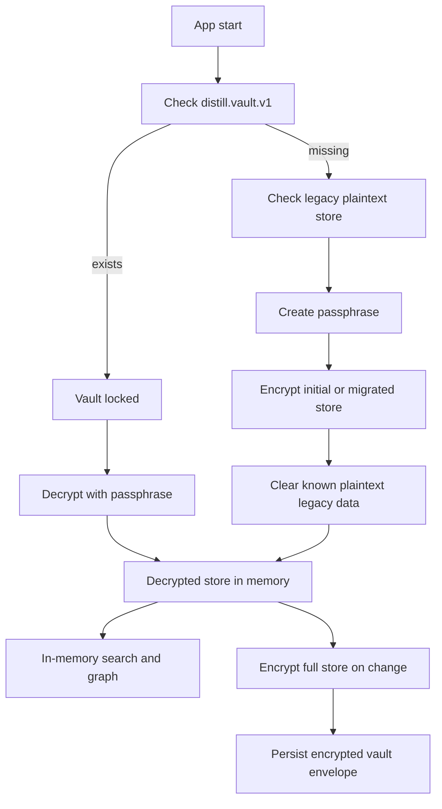

# Distill Encrypted Vault Design

## Current Implementation

Distill 0.1.36 uses an encrypted local vault for normal app persistence.

Implemented:

- App starts in a locked/setup vault gate instead of loading notes immediately.
- New users create a vault passphrase before entering the app.
- Existing plaintext local stores are migrated once into an encrypted vault.
- After migration, known plaintext SQLite tables, the legacy `distill.store.v1` JSON row, and the old automatic JSON backup are cleared.
- The persistent vault value is stored as `distill.vault.v1`.
- Desktop stores the encrypted envelope in the Tauri SQLite `app_store` table and writes an encrypted latest backup at `backups/distill-encrypted-vault-latest.json`.
- Browser/PWA preview stores the encrypted envelope in `indexedDB:distill-browser-vault/vaults/distill.vault.v1` when IndexedDB is available, migrates existing encrypted `localStorage:distill.vault.v1` values into IndexedDB, and uses localStorage only as a fallback.
- Search and graph are generated from the decrypted in-memory store after unlock, not from a persistent plaintext SQLite index.
- Users can change the vault passphrase from the Inspector.
- Distill can auto-lock after inactivity and locks when the document is hidden.
- JSON and encrypted vault restore now build a preview before replacing the current store.
- Manual sync packets use record-level encrypted records, packet-level sync KDF metadata, device registry metadata, revoked device metadata, and deletion tombstones.
- Desktop sync-folder packet exchange can write, scan, and preview encrypted packet files through the same explicit sync preview flow.
- Tests cover wrong passphrases, unsupported encrypted vault envelopes, and tampered vault payloads.

Vault envelope:

- file/storage format: Distill encrypted vault JSON
- envelope type: `distill.encrypted-vault`
- KDF: PBKDF2
- KDF hash: SHA-256
- default iterations: 310,000
- cipher: AES-256-GCM
- salt: 16 random bytes
- IV: 12 random bytes
- authentication: AES-GCM tag included in the encrypted payload

## Security Boundary

Protected at rest:

- block content
- project names/signals
- tags
- links
- people references
- exported encrypted vault backups
- normal local app persistence after vault creation/migration

Still in memory while unlocked:

- vault passphrase
- decrypted full store
- search results
- graph data

This is acceptable for the current local MVP, but it is not equivalent to a hardened password manager.

## Important Limits

- If the user forgets the passphrase, Distill cannot recover the vault.
- Normal vault autosave uses a non-exportable WebCrypto CryptoKey derived from the passphrase and vault KDF metadata at unlock/create time. The passphrase still remains in a volatile app-session ref for sync packet export/import until the cross-device sync-key design replaces passphrase-based packet encryption. New sync packets use one non-exportable WebCrypto sync session key per packet while old per-record encrypted packets remain readable.
- Normal vault persistence encrypts the whole store as one envelope, while manual sync packets encrypt individual records.
- Automatic/background sync is not implemented yet; desktop sync-folder packet exchange is explicit and user-triggered.
- Browser/PWA mode prefers IndexedDB and keeps localStorage only as a fallback/migration source, but browser profile compromise can still delete, replace, or copy encrypted data.
- Old plaintext copies outside known Distill paths, such as OS backups or manually exported JSON, cannot be erased by the app.

## Runtime Flow

## Tauri Command Boundary

Allowed desktop commands in the default capability:

- `load_store_json`: legacy migration read only
- `load_vault_json`: read encrypted vault envelope
- `save_vault_json`: write encrypted vault envelope
- `clear_plain_store`: delete known plaintext legacy data
- `load_storage_info_json`: show storage paths
- `start_update_installer`: validated manual installer fallback

Removed from frontend capability exposure:

- plaintext store save
- plaintext SQLite search
- plaintext SQLite graph loading

## Migration Behavior

When no encrypted vault exists:

1. Distill reads any existing legacy plaintext store.
2. The user creates and confirms a vault passphrase.
3. Distill encrypts the existing store, or the seeded initial store for new users.
4. Distill saves `distill.vault.v1`.
5. Distill clears the normalized plaintext tables and legacy plaintext JSON key.
6. Distill removes the known plaintext automatic backup file if present.

## Next Vault Milestones

1. Add emergency recovery/export guidance in the UI.
2. Move normal persistence from whole-store encryption to record-level encrypted records if automatic sync requires it.
3. Add encrypted append-only record log for automatic sync.
4. Evaluate Tauri Stronghold or platform keyring for optional convenience unlock.
5. Add user-selectable vault location and recovery guidance.
6. Add stronger crash-safe vault backup rotation.

## Release Gate Before Sync

Do not ship automatic sync until:

- encrypted local persistence is stable
- wrong passphrase tests pass
- corrupted payload tests pass
- record-level merge format is finalized beyond manual packets
- device identity, registry, and trust revocation flows are designed
- rollback/replay handling is defined
- recovery and device-loss scenarios are documented
