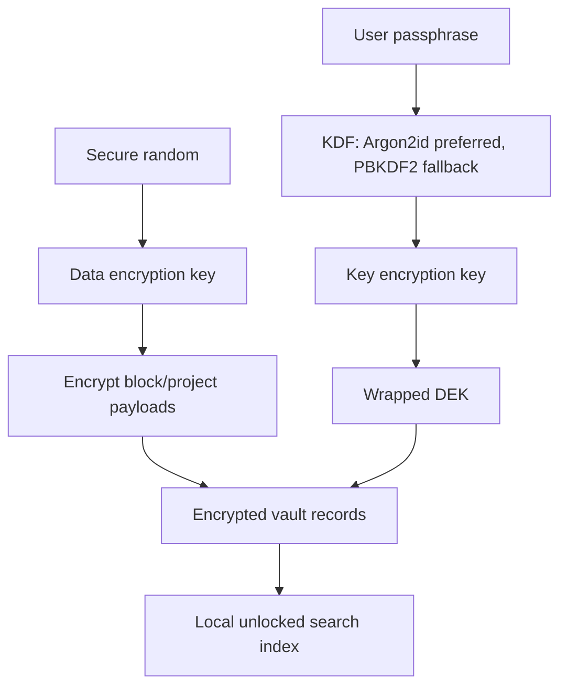

# Distill Encrypted Vault Design

## Current Implementation

Distill now supports encrypted portable backups:

- file format: `.distill-vault.json`
- KDF: PBKDF2
- KDF hash: SHA-256
- default iterations: 310,000
- cipher: AES-256-GCM
- salt: 16 random bytes
- IV: 12 random bytes
- authentication: AES-GCM tag included in the encrypted payload

This protects exported backups and gives the future sync layer a concrete encrypted envelope format.

## Important Limit

The active desktop SQLite database and automatic local JSON backup are **not encrypted at rest yet**. The encrypted vault backup is the first step, not the final vault.

## Why This Step First

At-rest encryption changes how search, graph, and indexing work. If every block is encrypted before SQLite indexing, local search cannot read it. If SQLite remains plaintext, search works but disk privacy is incomplete.

The safe sequence is:

1. Add encrypted export/import.
2. Add passphrase UX and recovery expectations.
3. Add encrypted local persistence.
4. Rebuild search/indexing around an unlocked in-memory working set.
5. Add sync only after encrypted envelopes are stable.

## Target Vault Architecture

## Recommended Final Design

### Keys

- Generate a random data encryption key per vault.
- Derive a key-encryption key from the passphrase.
- Wrap the data encryption key with the passphrase-derived key.
- Never store the raw passphrase.

### Desktop Secret Storage

Use Tauri Stronghold or a platform keyring only to protect convenience secrets, not as the only recovery mechanism. A user-owned passphrase must remain sufficient to unlock portable data.

Tauri Stronghold reference:

- https://v2.tauri.app/reference/javascript/stronghold/

### Data Model

Use record-level encryption:

- encrypted block payload
- encrypted project payload
- plaintext record IDs
- plaintext sync metadata
- optional plaintext coarse timestamps

Keep search indexes local to the unlocked device and rebuildable from decrypted records.

### Search

For privacy, do not sync plaintext search indexes.

Allowed:

- local in-memory index after unlock
- local encrypted cache if protected by the same vault key

Not allowed for E2EE sync:

- syncing plaintext FTS tokens
- syncing embeddings generated from private text unless encrypted and device-local

## Migration Plan

### Phase V1: Encrypted Portable Backups

Implemented:

- Encrypt JSON export with passphrase.
- Restore encrypted backup with passphrase.
- Reject wrong passphrase through AES-GCM authentication.

### Phase V2: Local Vault Lock

Next:

- Add app lock/unlock screen.
- Do not load notes until unlocked.
- Store encrypted vault envelope locally.
- Keep decrypted store only in memory while unlocked.

### Phase V3: Encrypted Local Persistence

Next:

- Replace plaintext `app_store` JSON with encrypted envelope.
- Decide whether normalized SQLite tables remain plaintext cache or become rebuildable unlocked cache.
- If cache remains plaintext, label it clearly as performance cache and add secure-clear option.

### Phase V4: Full Encrypted Vault

Next:

- Encrypt record payloads.
- Rebuild local index after unlock.
- Store only encrypted records persistently.
- Add vault backup/recovery UX.

## Release Gate Before Sync

Do not ship sync until:

- encrypted backup works
- encrypted local persistence is implemented
- wrong passphrase cannot reveal data
- export/recovery story is documented
- device loss scenario is tested
- merge/conflict format is finalized
